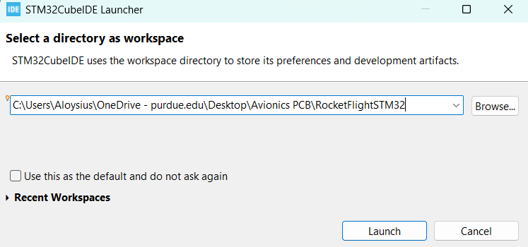

# STMCUBE setup to use the code for on-board LED toggling

- Clone the repo
- Open STMCubeIDE
- Set the workspace directory to wherever you cloned the RocketFlightSTM32, **make sure RocketFlightSTM32 is the last subdirectory** as shown in the example below

<!--  -->

    

- Click on Launch
- You should see the device configuration tool as shown below.

    

  

*If instead you see the homepage instead **just click on the import project button** as shown below and **open the RocketFlightSTM32 folder**. **DO NOT OPEN THE flightv1 folder***

    

  

- Because you cloned the repo everything should already be setup but still check the following.
- in the Device configuration tool, Under System core, click on RCC and ensure that the two red box areas are correct.

    

  

- Now click on GPIO, and then click PB14 and ensure again the red box area is correct.

    

  

*If PB14 does not exist in your tool search up PB14 on the search in the pinout view. Then click the PB14 pin on the image and set it to GPIO_Output as shown below*

    

  

- The last thing to check is that the clock configuration is correct. Make sure there is no warning or error sign on the clock configuration. If there is simply go to the tab, then say yes to the automatic clock configuration prompt that appears and it should fix itself. 

    

  

- Now go to the code view and open both main.c for both cores.

    

  

- As we assinged PB14 to core 7 we have written code to toggle the LED in the core 7 main. *if ever you are confused which main is which core's just double click the core main you want under Project Explorer and it should take you to the main file you want.*

- Follow steps 3.1 Setting up with ST-LINK GDB server at the below hyperlinked documentation. Disregard step 3.1.1 and 3.1.2.
[Debug config](https://community.st.com/t5/stm32cubeprogrammer-mcus/stm32h747-dual-core-programming-both-cores/td-p/269658)

- That's all that is needed for lighting up the LED3(red led) on the nucleo board.

- Simply click the run button and wait for the LED to blink on the board.